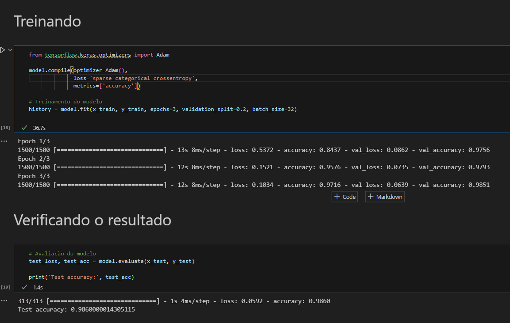

# Documentação do Projeto de Rede Neural Convulucional para Classificação do MNIST

## Introdução

Este documento detalha a implementação de uma rede neural convolucional (CNN) para classificar imagens do conjunto de dados MNIST. O MNIST é um conjunto de dados amplamente usado que consiste em imagens de dígitos manuscritos, servindo como um benchmark para algoritmos de visão computacional.

## Instalação e Execução

Para instalar e executar o sistema, siga as instruções abaixo:

1. **Instalação das Dependências**:
    ```bash
    pip install tensorflow matplotlib
    ```
    Este comando instala o TensorFlow, uma biblioteca poderosa para treinamento de redes neurais, e Matplotlib para visualização de dados.

2. **Execução do Script**:
    Execute o script Python que contém o código da CNN. Este notebook realizará o treinamento e a avaliação do modelo.

## Implementação

```python
from tensorflow.keras.models import Sequential
from tensorflow.keras.layers import Conv2D, MaxPooling2D, Flatten, Dense, Dropout

# Definindo as caracteristicas no modelo
model = Sequential([
# Primeira camada convolucional
Conv2D(32, (3, 3), activation='relu', input_shape=(28, 28, 1)),
MaxPooling2D(2, 2),

# Segunda camada convolucional
Conv2D(64, (3, 3), activation='relu'),
MaxPooling2D(2, 2),

# Terceira camada convolucional
Conv2D(64, (3, 3), activation='relu'),

# Achatar o output para DNN
Flatten(),

# Camada densa
Dense(64, activation='relu'),

# Dropout
Dropout(0.5),

# Camada de saída
Dense(10, activation='softmax')
])
```

### Pré-processamento dos Dados

Os dados do MNIST são normalizados para o intervalo [0,1] para facilitar o treinamento da rede. Eles são divididos em conjuntos de treinamento e teste para avaliação do modelo.

### Arquitetura da Rede Neural

A arquitetura da CNN implementada inclui três camadas convolucionais, cada uma seguida de uma camada de max pooling. Após as camadas convolucionais, os dados são achatados e passados através de uma camada densa com dropout para evitar overfitting. A camada de saída utiliza a ativação softmax para classificação multiclasse.

### Treinamento

A rede é treinada usando o otimizador Adam e a função de perda `sparse_categorical_crossentropy`. A acurácia é usada como métrica para monitorar o desempenho. O treinamento é realizado por 10 épocas, mas pode variar conforme necessário.

### Avaliação de Desempenho

Após o treinamento, a rede é avaliada no conjunto de teste para determinar sua precisão. O objetivo é alcançar uma acurácia maior que 95% com apenas 3 épocas de treinamento. Objetivo alcançado:



## Conclusão

Este sistema implementa uma arquitetura válida de rede neural convolucional para classificar com eficácia o conjunto de dados MNIST. A meta é alcançar uma acurácia superior a 95% no conjunto de treino com um número limitado de épocas, demonstrando a eficiência da arquitetura proposta e das técnicas de treinamento empregadas.


