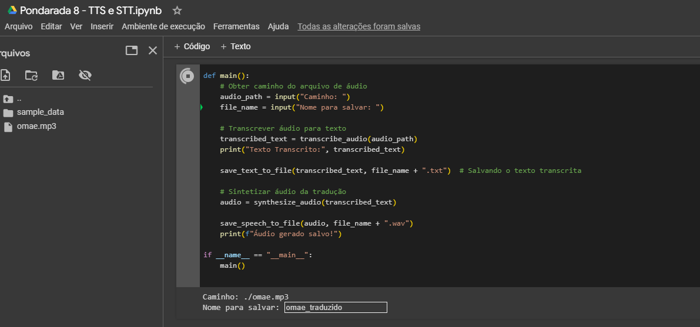
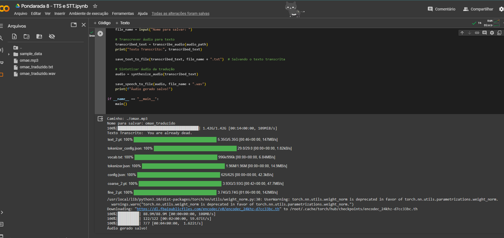

# TTS_e_STT

## Introdução

O `TTS_e_STT` é um projeto inovador que explora as capacidades de Conversão de Texto em Fala (Text-To-Speech, TTS) e Reconhecimento de Fala (Speech-To-Text, STT), utilizando as bibliotecas `whisper`, `bark`. Este projeto visa demonstrar como essas tecnologias podem ser integradas para criar um ciclo de transcrição de áudio para texto e, em seguida, síntese de áudio a partir desse texto, com um passo utilizando o próprio whisper para tradução do input para inglês. Disponível no [Collab](https://colab.research.google.com/drive/18NIPIXtY68bwLFqgMF13zHe4SjvfdyKN?usp=sharing), que apresentou melhor funcionamento perante sua utilização no Windows.

## Detalhamento do Código

### 1. Reconhecimento de Fala (STT) com `whisper`

- A biblioteca `whisper` é utilizada para transcrever áudio em texto. A função `transcribe_audio` carrega o modelo `whisper` e realiza a transcrição e tradução.

### 2. Conversão de Texto em Fala (TTS) com `bark`

- A biblioteca `bark` é usada para converter texto em áudio. A função `synthesize_audio` gera áudio a partir de um texto fornecido.

### 3. Funções Auxiliares

- `save_text_to_file`: Salva o texto transcrito em um arquivo.
- `save_speech_to_file`: Salva o áudio gerado em um arquivo WAV.

### 4. Script Principal `main`

- Este script combina as funcionalidades de STT e TTS em um fluxo de trabalho unificado. Ele solicita um caminho de arquivo de áudio, realiza a transcrição e tradução, salva o texto, e então sintetiza áudio a partir desse texto transcrito.

## Modo de Uso

Para usar este notebook:

1. **Instalar Dependências**: Assegure-se de que as bibliotecas `whisper`, `bark` estejam instaladas.
2. **Executar o Script Principal**: Execute o script `main` fornecendo o caminho do arquivo de áudio e o nome para salvar quando solicitado na UI (Terminal).

3. **Visualizar Resultados**: O texto transcrito será salvo em um arquivo .txt e o áudio gerado será salvo em um arquivo WAV.

## Conclusão

Este projeto demonstra o poder e a flexibilidade das tecnologias de TTS e STT. A capacidade de converter áudio em texto e, em seguida, gerar áudio a partir desse texto, tem aplicações vastas, desde assistentes virtuais até ferramentas educacionais. O `TTS_e_STT` serve como um exemplo prático dessas tecnologias em ação.

## Referências

- Documentação do `whisper`: [Link para Documentação](https://openai.com/blog/whisper/)
- Documentação do `bark`: [Link para GitHub do Bark](https://github.com/suno-ai/bark)
- Documentação do `simpleaudio`: [Link para Documentação do SimpleAudio](https://simpleaudio.readthedocs.io/)

